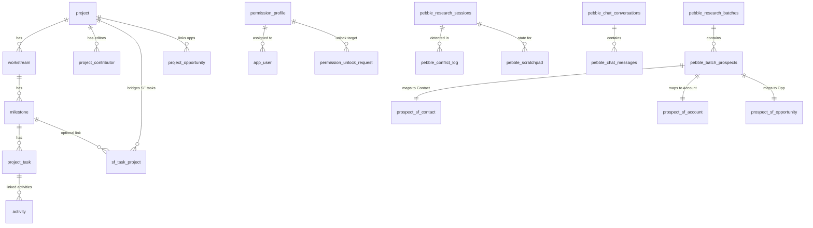

# Database Schema Reference

> **Source of truth:** `financial_forecasting/db/init.sql` (1118 lines).
> Every table, column, type, and constraint in this document comes from the DDL.
> Generated 2026-04-08. Supersedes `database-schema-rundown.md` and `database-schema-atlas.md`.

---

## 1. Executive Overview

### Three-Tier Architecture

```
 SALESFORCE (Live SOQL)             BEDROCK SCHEMA (segundo-db)           PUBLIC SCHEMA (segundo-db)
 ========================          ==============================         ==========================
                                                                          org_users (staff identity)
  Opportunity  ----sync--->  activity (mirror)                            companies
  Account      ----sync--->  activity (mirror)
  Contact      ----live--    (no local mirror)                     FK:  app_user.org_user_id --> org_users.id
  Payment      ----live--    (no local mirror)                     FK:  sf_account_company_map.public_company_id
  Task         ----sync--->  activity (mirror)                           --> companies.company_id
  Event        ----sync--->  activity (mirror)
  User         ----live--    (no local mirror)            bedrock schema tables (33 total):
  OppFieldHist ----live--    (no local mirror)              project, workstream, milestone, project_task,
                                                            project_contributor, sf_task_dependency,
  <---write---  CRM bridge writes from Pebble              sf_task_project, project_opportunity,
                (prospect_sf_contact/account/opp)           permission_profile, app_user,
                                                            opportunity_lock, permission_unlock_request,
                                                            activity, pebble_* (13 tables),
                                                            prospect_sf_* (3 tables),
                                                            sf_field_requirements, sf_schema_drift_log,
                                                            sf_account_company_map, owner_goal
```

### Domain Summary

| Domain | Tables | Purpose |
|--------|--------|---------|
| A: Project Management | 8 | Projects, workstreams, milestones, tasks, SF task bridging |
| B: Auth & Identity | 4 | Permission profiles, user records, Opp locks, unlock requests |
| C: Activities | 1 | Mirror of SF Tasks + Events + manual/extension entries (30 columns) |
| D: Pebble Research | 13 | Research pipeline, chat, batches, conflict tracking, daily usage |
| E: Prospect to SF Mapping | 5 | Field requirements, contact/account/opportunity mapping, schema drift |
| F: Company Bridge | 1 | SF Account to public.companies identity link |
| G: Wall of Progress | 1 | Per-owner annual revenue goals |
| **Total** | **33** | |

### Data Flow Summary

| Entity | Direction | Mechanism |
|--------|-----------|-----------|
| Opportunities | SF --> Bedrock (read-only) | Live SOQL, no local mirror |
| Accounts | SF --> Bedrock (read-only) | Live SOQL, no local mirror |
| Contacts | SF --> Bedrock (read-only) | Live SOQL, no local mirror |
| Payments | SF --> Bedrock (read-only) | Live SOQL, no local mirror |
| Tasks/Events | SF --> Bedrock (sync) | Watermark-based incremental sync into `activity` table |
| Users | SF --> Bedrock (read-only) | Live SOQL for name resolution |
| OppFieldHistory | SF --> Bedrock (read-only) | Live SOQL for stage/owner change tracking |
| Prospect data | Bedrock --> SF (write) | CRM bridge pushes via `prospect_sf_contact`, `prospect_sf_account` |
| Projects | Bedrock-only | No SF equivalent; local project management |
| Permissions | Bedrock-only | RBAC profiles and user assignment |
| Pebble research | Bedrock-only | AI research pipeline state |
| Owner goals | Bedrock-only | Annual revenue targets per SF user |

---

## 2. Connection & Infrastructure

### segundo-db (Production)

| Property | Value |
|----------|-------|
| Host | `34.57.101.141:5432` (GCP Cloud SQL) |
| Database | `bedrock` |
| Role | `bedrock_user` |
| Schema | `bedrock` (all 33 tables) |
| Public schema access | Read-only (can SELECT from `org_users`, `companies`, etc.) |
| Write restriction | Cannot write to `public.*` tables; FKs to public schema use `ON DELETE SET NULL` |

### asyncpg Pool Configuration

From `db.py` lines 37-43:

```python
DATABASE_URL = os.getenv("DATABASE_URL", "postgresql://bedrock@localhost:5432/bedrock")
_pool = await asyncpg.create_pool(DATABASE_URL, min_size=2, max_size=10)
```

| Parameter | Value |
|-----------|-------|
| Driver | asyncpg |
| min_size | 2 |
| max_size | 10 |
| Default URL | `postgresql://bedrock@localhost:5432/bedrock` |

### Initialization Flow

1. **Pool creation** -- `asyncpg.create_pool()`. If this fails, `_db_init_status = "disconnected"` and all DB operations fail gracefully.
2. **Schema init** -- Reads and executes `db/init.sql`. If this fails (permissions, already applied), the pool stays alive and `_db_init_status = "init_failed"`.
3. **Seed data** -- Reads and executes `db/seed.sql`. Idempotent via `ON CONFLICT DO NOTHING`.
4. **Health check** -- Verifies `public.org_users` has columns `id`, `email`, `display_name`, `google_id`. Non-fatal: logs a warning on local-dev databases without the learning platform schema.

### Local Dev Setup

- Create schema manually: `CREATE SCHEMA IF NOT EXISTS bedrock;`
- The `DO $$ ... EXCEPTION WHEN insufficient_privilege` block in init.sql handles this gracefully.
- FKs to `public.org_users` and `public.companies` silently skip on local-dev databases (caught by `EXCEPTION WHEN undefined_table`).
- Default connection: `postgresql://bedrock@localhost:5432/bedrock` (no password for local dev).

### Scaling Concerns

- Pool capped at 10 connections. No PgBouncer. Under sustained load this is a bottleneck.
- No connection retry logic beyond asyncpg's built-in pool management.
- Health check runs once at startup, not periodically.

---

## 3. Salesforce Objects Reference

All SF objects are queried via live SOQL through the `salesforce` MCP service. Only Tasks and Events are synced into a local mirror (`activity`). Everything else is read live on each API call.

| SF Object | Direction | Local Mirror | Key Fields | Source Files |
|-----------|-----------|-------------|------------|-------------|
| Opportunity | Read | None | Id, AccountId, Name, StageName, Amount, Probability, CloseDate, OwnerId, Type, Payment_Terms__c, Contract_Start_Date__c, Contract_End_Date__c, Billing_Frequency__c, RenewalRepeat__c, Active_Opportunity__c, npe01__Payments_Made__c, Outstanding_Payments__c, CampaignId | `types/salesforce.ts` (lines 79-120), `routes/opportunities.py` |
| Account | Read | None | Id, Name, Type, Industry, Website, OwnerId, Account_Tier__c, npsp__Grantmaker__c, npo02__TotalOppAmount__c, Philanthropy__c, Fee_For_Service__c, AnnualRevenue | `types/salesforce.ts` (lines 122-193), `routes/accounts.py` |
| Contact | Read | None | Id, AccountId, FirstName, LastName, Title, Email, Phone, OwnerId, LinkedIn_URL__c, Philanthropic_Contact__c, npsp__Primary_Affiliation__c | `types/salesforce.ts` (lines 195-256), `routes/contacts.py` |
| npe01__OppPayment__c | Read/Write | None | Id, npe01__Opportunity__c, npe01__Payment_Amount__c, npe01__Scheduled_Date__c, npe01__Payment_Date__c, npe01__Paid__c, npe01__Payment_Method__c, Invoice__c | `types/salesforce.ts` (lines 258-289), `routes/payments.py` |
| Task | Sync | `activity` | Id, Subject, Status, Priority, ActivityDate, Description, OwnerId, WhoId, WhatId, Type, TaskSubtype, IsClosed, CallType, CallDurationInSeconds | `data_sync.py` (lines 63-71) |
| Event | Sync | `activity` | Id, Subject, Description, StartDateTime, EndDateTime, OwnerId, WhoId, WhatId, Type, Location, DurationInMinutes, IsAllDayEvent | `data_sync.py` (lines 75-83) |
| OpportunityFieldHistory | Read | None | OpportunityId, Field, OldValue, NewValue, CreatedDate, CreatedById | `routes/opportunities_extra.py`, `routes/ai.py` |
| User | Read | None | Id, Name, Email, Username, IsActive | `routes/auth.py`, `routes/ai.py`, `mcp_client/services/salesforce.py` |

---

## 4. Domain-by-Domain Table Reference

### Domain A: Project Management (8 tables)

---

#### `bedrock.project` (line 13)

One-line: Top-level project container with ownership and soft-delete.

| Column | Type | Constraints |
|--------|------|-------------|
| id | UUID | PK, DEFAULT uuid_generate_v4() |
| name | TEXT | NOT NULL |
| description | TEXT | NOT NULL DEFAULT '' |
| created_at | TIMESTAMPTZ | NOT NULL DEFAULT now() |
| updated_at | TIMESTAMPTZ | NOT NULL DEFAULT now() |
| deleted_at | TIMESTAMPTZ | (added via DO block, line 75) |
| deleted_by | TEXT | (added via DO block, line 77) |
| owner_email | TEXT | (added via DO block, line 98) |
| created_by | TEXT | (added via DO block, line 100) |
| opportunity_id | TEXT | (added via DO block, line 201) |

- **Primary key:** `id`
- **Indexes:** `idx_project_not_deleted` -- partial on `deleted_at` WHERE `deleted_at IS NULL` (line 118)
- **Triggers:** `trg_project_updated_at` BEFORE UPDATE, executes `bedrock.set_updated_at()` (line 132-144)

---

#### `bedrock.workstream` (line 21)

One-line: Grouping of milestones within a project.

| Column | Type | Constraints |
|--------|------|-------------|
| id | UUID | PK, DEFAULT uuid_generate_v4() |
| project_id | UUID | NOT NULL, FK --> project(id) ON DELETE CASCADE |
| name | TEXT | NOT NULL |
| description | TEXT | NOT NULL DEFAULT '' |
| sort_order | INT | NOT NULL DEFAULT 0 |
| created_at | TIMESTAMPTZ | NOT NULL DEFAULT now() |
| updated_at | TIMESTAMPTZ | NOT NULL DEFAULT now() |
| deleted_at | TIMESTAMPTZ | (added via DO block, line 80) |
| deleted_by | TEXT | (added via DO block, line 82) |

- **Primary key:** `id`
- **Foreign keys:** `project_id` --> `bedrock.project(id)` ON DELETE CASCADE
- **Indexes:** `idx_workstream_not_deleted` -- partial on `deleted_at` WHERE `deleted_at IS NULL` (line 119)
- **Triggers:** `trg_workstream_updated_at` BEFORE UPDATE, executes `bedrock.set_updated_at()` (line 132-144)

---

#### `bedrock.milestone` (line 31)

One-line: Deliverable checkpoint within a workstream.

| Column | Type | Constraints |
|--------|------|-------------|
| id | UUID | PK, DEFAULT uuid_generate_v4() |
| workstream_id | UUID | NOT NULL, FK --> workstream(id) ON DELETE CASCADE |
| title | TEXT | NOT NULL |
| status | TEXT | NOT NULL DEFAULT 'On Track', CHECK IN ('On Track', 'At Risk', 'Needs Attention', 'Completed') |
| priority | TEXT | NOT NULL DEFAULT 'Now', CHECK IN ('Now', 'Later', 'On-going') |
| owner | TEXT | NOT NULL DEFAULT '' |
| description | TEXT | NOT NULL DEFAULT '' |
| source_links | TEXT[] | NOT NULL DEFAULT '{}' |
| sort_order | INT | NOT NULL DEFAULT 0 |
| created_at | TIMESTAMPTZ | NOT NULL DEFAULT now() |
| updated_at | TIMESTAMPTZ | NOT NULL DEFAULT now() |
| deleted_at | TIMESTAMPTZ | (added via DO block, line 85) |
| deleted_by | TEXT | (added via DO block, line 87) |

- **Primary key:** `id`
- **Foreign keys:** `workstream_id` --> `bedrock.workstream(id)` ON DELETE CASCADE
- **Indexes:** `idx_milestone_not_deleted` -- partial on `deleted_at` WHERE `deleted_at IS NULL` (line 120)
- **Triggers:** `trg_milestone_updated_at` BEFORE UPDATE, executes `bedrock.set_updated_at()` (line 132-144)

---

#### `bedrock.project_task` (line 47)

One-line: Actionable work item within a milestone, with dependency tracking and Gantt support.

| Column | Type | Constraints |
|--------|------|-------------|
| id | UUID | PK, DEFAULT uuid_generate_v4() |
| milestone_id | UUID | NOT NULL, FK --> milestone(id) ON DELETE CASCADE |
| title | TEXT | NOT NULL |
| status | TEXT | NOT NULL DEFAULT 'Not Started', CHECK IN ('Not Started', 'In Progress', 'Completed', 'Blocked', 'On Hold') |
| owner | TEXT | NOT NULL DEFAULT '' |
| deadline | DATE | |
| description | TEXT | NOT NULL DEFAULT '' |
| updates | TEXT | NOT NULL DEFAULT '' |
| links | TEXT[] | NOT NULL DEFAULT '{}' |
| depends_on | UUID[] | NOT NULL DEFAULT '{}' |
| sort_order | INT | NOT NULL DEFAULT 0 |
| created_at | TIMESTAMPTZ | NOT NULL DEFAULT now() |
| updated_at | TIMESTAMPTZ | NOT NULL DEFAULT now() |
| start_date | DATE | (added via DO block, line 66) |
| deleted_at | TIMESTAMPTZ | (added via DO block, line 90) |
| deleted_by | TEXT | (added via DO block, line 92) |

- **Primary key:** `id`
- **Foreign keys:** `milestone_id` --> `bedrock.milestone(id)` ON DELETE CASCADE
- **Indexes:** `idx_project_task_not_deleted` -- partial on `deleted_at` WHERE `deleted_at IS NULL` (line 121)
- **Triggers:** `trg_project_task_updated_at` BEFORE UPDATE, executes `bedrock.set_updated_at()` (line 132-144)

---

#### `bedrock.project_contributor` (line 104)

One-line: Many-to-many editors for projects (M19 ownership model).

| Column | Type | Constraints |
|--------|------|-------------|
| id | UUID | PK, DEFAULT uuid_generate_v4() |
| project_id | UUID | NOT NULL, FK --> project(id) ON DELETE CASCADE |
| user_email | TEXT | NOT NULL |
| role | TEXT | NOT NULL DEFAULT 'editor', CHECK IN ('editor') |
| added_by | TEXT | |
| added_at | TIMESTAMPTZ | NOT NULL DEFAULT now() |

- **Primary key:** `id`
- **Unique constraint:** `(project_id, user_email)` (line 111)
- **Foreign keys:** `project_id` --> `bedrock.project(id)` ON DELETE CASCADE
- **Indexes:**
  - `idx_contributor_project` on `project_id` (line 114)
  - `idx_contributor_email` on `user_email` (line 115)

---

#### `bedrock.sf_task_dependency` (line 149)

One-line: Dependency edges between external CRM tasks (SF has no native dependency support).

| Column | Type | Constraints |
|--------|------|-------------|
| id | UUID | PK, DEFAULT uuid_generate_v4() |
| task_id | TEXT | NOT NULL |
| depends_on_id | TEXT | NOT NULL |
| external_source | TEXT | NOT NULL DEFAULT 'salesforce' |
| created_at | TIMESTAMPTZ | NOT NULL DEFAULT now() |

- **Primary key:** `id`
- **Unique constraint:** `(task_id, depends_on_id)` (line 155)
- **Indexes:**
  - `idx_sf_dep_task` on `task_id` (line 157)
  - `idx_sf_dep_depends` on `depends_on_id` (line 158)

---

#### `bedrock.sf_task_project` (line 169)

One-line: Bridge linking external CRM tasks to local projects (critical SF coupling point).

| Column | Type | Constraints |
|--------|------|-------------|
| id | UUID | PK, DEFAULT uuid_generate_v4() |
| sf_task_id | TEXT | NOT NULL |
| external_source | TEXT | NOT NULL DEFAULT 'salesforce' |
| project_id | UUID | NOT NULL, FK --> project(id) ON DELETE CASCADE |
| milestone_id | UUID | FK --> milestone(id) ON DELETE SET NULL |
| sort_order | INT | DEFAULT 0 |
| created_at | TIMESTAMPTZ | NOT NULL DEFAULT now() |
| updated_at | TIMESTAMPTZ | NOT NULL DEFAULT now() |

- **Primary key:** `id`
- **Unique constraint:** `(sf_task_id)` (line 178)
- **Foreign keys:**
  - `project_id` --> `bedrock.project(id)` ON DELETE CASCADE
  - `milestone_id` --> `bedrock.milestone(id)` ON DELETE SET NULL
- **Indexes:**
  - `idx_stp_project` on `project_id` (line 180)
  - `idx_stp_source` on `external_source` (line 181)

---

#### `bedrock.project_opportunity` (line 211)

One-line: Many-to-many junction between projects and CRM opportunities.

| Column | Type | Constraints |
|--------|------|-------------|
| id | UUID | PK, DEFAULT uuid_generate_v4() |
| project_id | UUID | NOT NULL, FK --> project(id) ON DELETE CASCADE |
| opportunity_id | TEXT | NOT NULL |
| role | TEXT | NOT NULL DEFAULT 'linked' |
| created_at | TIMESTAMPTZ | NOT NULL DEFAULT now() |

- **Primary key:** `id`
- **Unique constraint:** `(project_id, opportunity_id)` (line 217)
- **Foreign keys:** `project_id` --> `bedrock.project(id)` ON DELETE CASCADE
- **Indexes:**
  - `idx_po_project` on `project_id` (line 219)
  - `idx_po_opp` on `opportunity_id` (line 220)

---

### Domain B: Auth & Identity (4 tables)

---

#### `bedrock.permission_profile` (line 232)

One-line: Named permission bundle (JSONB map of 33 boolean keys) assignable to users.

| Column | Type | Constraints |
|--------|------|-------------|
| id | UUID | PK, DEFAULT uuid_generate_v4() |
| name | TEXT | NOT NULL UNIQUE |
| description | TEXT | DEFAULT '' |
| is_default | BOOLEAN | DEFAULT false |
| permissions | JSONB | NOT NULL DEFAULT '{}' |
| created_at | TIMESTAMPTZ | DEFAULT now() |
| updated_at | TIMESTAMPTZ | DEFAULT now() |

- **Primary key:** `id`
- **Unique constraint:** `name`

Seeded profiles (4): Admin, Relationship Manager (is_default=true), Executive, Project Manager. See init.sql lines 342-504 for full permission maps.

---

#### `bedrock.app_user` (line 242)

One-line: Bedrock user identity linked to SF User and (optionally) platform org_users.

| Column | Type | Constraints |
|--------|------|-------------|
| id | UUID | PK, DEFAULT uuid_generate_v4() |
| sf_user_id | TEXT | UNIQUE |
| email | TEXT | NOT NULL UNIQUE |
| name | TEXT | DEFAULT '' |
| profile_id | UUID | FK --> permission_profile(id) ON DELETE SET NULL |
| is_active | BOOLEAN | DEFAULT true |
| created_at | TIMESTAMPTZ | DEFAULT now() |
| updated_at | TIMESTAMPTZ | DEFAULT now() |
| org_user_id | UUID | (added via DO block, line 262); FK --> public.org_users(id) ON DELETE SET NULL (conditional -- skips on local dev) |

- **Primary key:** `id`
- **Unique constraints:** `sf_user_id`, `email`
- **Foreign keys:**
  - `profile_id` --> `bedrock.permission_profile(id)` ON DELETE SET NULL
  - `org_user_id` --> `public.org_users(id)` ON DELETE SET NULL (conditional FK, line 270-279)
- **Indexes:** `idx_app_user_org_user_id` -- partial on `org_user_id` WHERE `org_user_id IS NOT NULL` (line 281-282)

---

#### `bedrock.opportunity_lock` (line 284)

One-line: Pessimistic lock on SF opportunities to prevent concurrent edits.

| Column | Type | Constraints |
|--------|------|-------------|
| sf_opportunity_id | TEXT | PK |
| locked_by | TEXT | NOT NULL |
| locked_at | TIMESTAMPTZ | DEFAULT now() |

- **Primary key:** `sf_opportunity_id`
- **Indexes:** `idx_opp_lock_locked_by` on `locked_by` (line 289)

---

#### `bedrock.permission_unlock_request` (line 513)

One-line: User request to unlock a permission key on their profile, awaiting admin approval.

| Column | Type | Constraints |
|--------|------|-------------|
| id | UUID | PK, DEFAULT uuid_generate_v4() |
| requester_email | TEXT | NOT NULL |
| profile_id | UUID | NOT NULL, FK --> permission_profile(id) ON DELETE CASCADE |
| permission_key | TEXT | NOT NULL |
| status | TEXT | NOT NULL DEFAULT 'pending', CHECK IN ('pending', 'approved', 'rejected') |
| admin_note | TEXT | DEFAULT '' |
| created_at | TIMESTAMPTZ | DEFAULT now() |
| resolved_at | TIMESTAMPTZ | |
| resolved_by | TEXT | |

- **Primary key:** `id`
- **Foreign keys:** `profile_id` --> `bedrock.permission_profile(id)` ON DELETE CASCADE
- **Indexes:** `idx_unlock_req_status` on `status` (line 525)

---

### Domain C: Activities (1 table)

---

#### `bedrock.activity` (line 531)

One-line: Unified activity timeline -- mirrors SF Tasks/Events and holds manual/extension entries (30 columns).

| Column | Type | Constraints |
|--------|------|-------------|
| id | UUID | PK, DEFAULT uuid_generate_v4() |
| sf_id | TEXT | UNIQUE |
| sf_type | TEXT | CHECK IN ('Task', 'Event') |
| type | TEXT | NOT NULL, CHECK IN ('call', 'email', 'meeting', 'note', 'slack-message', 'calendar-event') |
| subject | TEXT | NOT NULL |
| description | TEXT | |
| description_html | TEXT | |
| activity_date | TIMESTAMPTZ | NOT NULL |
| opportunity_id | TEXT | |
| account_id | TEXT | |
| contact_ids | TEXT[] | DEFAULT '{}' |
| project_task_id | UUID | FK --> project_task(id) ON DELETE SET NULL |
| sf_task_id | TEXT | |
| source | TEXT | NOT NULL, CHECK IN ('salesforce', 'extension', 'manual', 'gmail-sync', 'calendar-sync') |
| source_ref | TEXT | |
| source_thread_id | TEXT | |
| email_from | TEXT | |
| email_to | TEXT[] | |
| email_cc | TEXT[] | |
| email_snippet | TEXT | |
| meeting_duration_minutes | INTEGER | |
| meeting_attendees | JSONB | |
| meeting_location | TEXT | |
| attachments | JSONB | DEFAULT '[]' |
| logged_by | TEXT | |
| owner_id | TEXT | |
| sf_last_modified | TIMESTAMPTZ | |
| synced_at | TIMESTAMPTZ | |
| sf_sync_status | TEXT | DEFAULT 'synced', CHECK IN ('synced', 'pending', 'failed') |
| search_vector | TSVECTOR | |
| deleted_at | TIMESTAMPTZ | |
| created_at | TIMESTAMPTZ | NOT NULL DEFAULT now() |
| updated_at | TIMESTAMPTZ | NOT NULL DEFAULT now() |

- **Primary key:** `id`
- **Unique constraint:** `sf_id`
- **Foreign keys:** `project_task_id` --> `bedrock.project_task(id)` ON DELETE SET NULL
- **Indexes (12):**
  - `idx_activity_opportunity` on `opportunity_id` (line 592)
  - `idx_activity_account` on `account_id` (line 593)
  - `idx_activity_contact` GIN on `contact_ids` (line 594)
  - `idx_activity_date` on `activity_date DESC` (line 595)
  - `idx_activity_type` on `type` (line 596)
  - `idx_activity_source` on `source` (line 597)
  - `idx_activity_sf_id` on `sf_id` (line 598)
  - `idx_activity_search` GIN on `search_vector` (line 599)
  - `idx_activity_thread` on `source_thread_id` (line 600)
  - `idx_activity_not_deleted` partial on `deleted_at` WHERE `deleted_at IS NULL` (line 601)
  - `idx_activity_project_task` on `project_task_id` (line 602)
- **Triggers:**
  - `trg_activity_search_vector` BEFORE INSERT OR UPDATE, executes `bedrock.activity_search_vector_update()` (line 616-618) -- weighted tsvector: subject=A, email_snippet=B, description=C
  - `trg_activity_updated_at` BEFORE UPDATE, executes `bedrock.set_updated_at()` (line 621-624)

---

### Domain D: Pebble Research (13 tables)

---

#### `bedrock.pebble_profiles` (line 632)

One-line: Final research output per contact (one row per contact).

| Column | Type | Constraints |
|--------|------|-------------|
| contact_id | TEXT | PK |
| profile_json | TEXT | |
| cost_usd | NUMERIC | |
| created_at | TIMESTAMPTZ | DEFAULT now() |

- **Primary key:** `contact_id`

---

#### `bedrock.pebble_research_sessions` (line 640)

One-line: One row per completed research run with agent logs and batch linkage.

| Column | Type | Constraints |
|--------|------|-------------|
| id | UUID | PK, DEFAULT uuid_generate_v4() |
| contact_id | TEXT | |
| profile_json | TEXT | |
| cost_usd | NUMERIC | |
| prospect_name | TEXT | |
| prospect_org | TEXT | |
| status | TEXT | DEFAULT 'completed' |
| tier | TEXT | |
| agents_log_json | TEXT | |
| batch_id | TEXT | |
| created_at | TIMESTAMPTZ | DEFAULT now() |

- **Primary key:** `id`
- **Indexes:** `idx_pebble_rs_contact` on `contact_id` (line 653)

---

#### `bedrock.pebble_feedback` (line 656)

One-line: Claim accuracy tracking (user marks claims correct/incorrect).

| Column | Type | Constraints |
|--------|------|-------------|
| id | UUID | PK, DEFAULT uuid_generate_v4() |
| claim_id | TEXT | |
| correct | BOOLEAN | |
| text | TEXT | |
| contact_id | TEXT | |
| user_id | TEXT | |
| created_at | TIMESTAMPTZ | DEFAULT now() |

- **Primary key:** `id`

---

#### `bedrock.pebble_harness_log` (line 667)

One-line: Agent execution metrics (cost, tokens, latency, errors).

| Column | Type | Constraints |
|--------|------|-------------|
| id | UUID | PK, DEFAULT uuid_generate_v4() |
| agent_name | TEXT | |
| outcome | TEXT | |
| cost_usd | NUMERIC | |
| tokens_input | INTEGER | |
| tokens_output | INTEGER | |
| attempts | INTEGER | |
| elapsed_seconds | NUMERIC | |
| error | TEXT | |
| prospect_id | TEXT | |
| user_email | TEXT | |
| created_at | TIMESTAMPTZ | DEFAULT now() |

- **Primary key:** `id`

---

#### `bedrock.pebble_source_scores` (line 683)

One-line: Stigmergy pheromone trail -- data source richness scores per prospect.

| Column | Type | Constraints |
|--------|------|-------------|
| id | UUID | PK, DEFAULT uuid_generate_v4() |
| source_name | TEXT | |
| richness_score | NUMERIC | |
| prospect_id | TEXT | |
| created_at | TIMESTAMPTZ | DEFAULT now() |

- **Primary key:** `id`

---

#### `bedrock.pebble_api_cache` (line 692)

One-line: Response deduplication with TTL for external API calls.

| Column | Type | Constraints |
|--------|------|-------------|
| id | UUID | PK, DEFAULT uuid_generate_v4() |
| source | TEXT | |
| lookup_key | TEXT | |
| response_json | TEXT | |
| created_at | TIMESTAMPTZ | DEFAULT now() |
| expires_at | TIMESTAMPTZ | |

- **Primary key:** `id`
- **Unique constraint:** `(source, lookup_key)` (line 699)

---

#### `bedrock.pebble_chat_conversations` (line 703)

One-line: Ask Pebble chat session container with cost tracking.

| Column | Type | Constraints |
|--------|------|-------------|
| id | UUID | PK |
| user_email | TEXT | |
| title | TEXT | |
| total_cost_usd | NUMERIC | DEFAULT 0.0 |
| created_at | TIMESTAMPTZ | DEFAULT now() |
| updated_at | TIMESTAMPTZ | DEFAULT now() |

- **Primary key:** `id`
- **Triggers:** `trg_pebble_chat_conversations_updated_at` BEFORE UPDATE, executes `bedrock.set_updated_at()` (line 1069-1091)

---

#### `bedrock.pebble_chat_messages` (line 713)

One-line: Individual chat messages with tier and cost metadata.

| Column | Type | Constraints |
|--------|------|-------------|
| id | UUID | PK |
| conversation_id | UUID | FK --> pebble_chat_conversations(id) |
| role | TEXT | |
| content | TEXT | |
| tier | TEXT | |
| cost_usd | NUMERIC | DEFAULT 0.0 |
| metadata_json | TEXT | |
| created_at | TIMESTAMPTZ | DEFAULT now() |

- **Primary key:** `id`
- **Foreign keys:** `conversation_id` --> `bedrock.pebble_chat_conversations(id)`
- **Indexes:** `idx_pebble_cm_conv` on `conversation_id` (line 723)

---

#### `bedrock.pebble_research_batches` (line 726)

One-line: Bulk research job container with progress tracking.

| Column | Type | Constraints |
|--------|------|-------------|
| id | UUID | PK |
| user_email | TEXT | |
| total_prospects | INTEGER | DEFAULT 0 |
| completed_prospects | INTEGER | DEFAULT 0 |
| target_tier | TEXT | DEFAULT 'T1' |
| status | TEXT | DEFAULT 'pending' |
| total_cost_usd | NUMERIC | DEFAULT 0.0 |
| created_at | TIMESTAMPTZ | DEFAULT now() |
| updated_at | TIMESTAMPTZ | DEFAULT now() |

- **Primary key:** `id`
- **Triggers:** `trg_pebble_research_batches_updated_at` BEFORE UPDATE, executes `bedrock.set_updated_at()` (line 1069-1091)

---

#### `bedrock.pebble_batch_prospects` (line 739)

One-line: Individual prospect within a research batch, with identity confidence and CRM status.

| Column | Type | Constraints |
|--------|------|-------------|
| id | UUID | PK |
| batch_id | UUID | FK --> pebble_research_batches(id) |
| prospect_name | TEXT | |
| prospect_org | TEXT | |
| current_tier | TEXT | DEFAULT 'pending' |
| identity_confidence | TEXT | DEFAULT 'none' |
| crm_status | TEXT | DEFAULT 'unknown' |
| result_json | TEXT | |
| cost_usd | NUMERIC | DEFAULT 0.0 |
| created_at | TIMESTAMPTZ | DEFAULT now() |
| updated_at | TIMESTAMPTZ | DEFAULT now() |

- **Primary key:** `id`
- **Foreign keys:** `batch_id` --> `bedrock.pebble_research_batches(id)`
- **Indexes:** `idx_pebble_bp_batch` on `batch_id` (line 752)
- **Triggers:** `trg_pebble_batch_prospects_updated_at` BEFORE UPDATE, executes `bedrock.set_updated_at()` (line 1069-1091)

---

#### `bedrock.pebble_conflict_log` (line 755)

One-line: Detected conflicts between research claims (claim_a vs claim_b).

| Column | Type | Constraints |
|--------|------|-------------|
| id | UUID | PK, DEFAULT uuid_generate_v4() |
| session_id | UUID | FK --> pebble_research_sessions(id) |
| contact_id | TEXT | |
| conflict_type | TEXT | |
| claim_a | TEXT | |
| claim_b | TEXT | |
| description | TEXT | |
| resolution | TEXT | |
| created_at | TIMESTAMPTZ | DEFAULT now() |

- **Primary key:** `id`
- **Foreign keys:** `session_id` --> `bedrock.pebble_research_sessions(id)`
- **Indexes:** `idx_pebble_cl_session` on `session_id` (line 766)

---

#### `bedrock.pebble_scratchpad` (line 769)

One-line: Intermediate research state persisted between agent runs.

| Column | Type | Constraints |
|--------|------|-------------|
| id | UUID | PK, DEFAULT uuid_generate_v4() |
| session_id | UUID | FK --> pebble_research_sessions(id) |
| contact_id | TEXT | |
| scratchpad_json | TEXT | |
| status | TEXT | |
| created_at | TIMESTAMPTZ | DEFAULT now() |
| updated_at | TIMESTAMPTZ | DEFAULT now() |

- **Primary key:** `id`
- **Foreign keys:** `session_id` --> `bedrock.pebble_research_sessions(id)`
- **Indexes:** `idx_pebble_sp_session` -- UNIQUE index on `session_id` (line 780; upgraded from non-unique for ON CONFLICT support)
- **Triggers:** `trg_pebble_scratchpad_updated_at` BEFORE UPDATE, executes `bedrock.set_updated_at()` (line 1069-1091)

---

#### `bedrock.pebble_daily_usage` (line 783)

One-line: Per-user daily cost and query count tracking (Pebble access control).

| Column | Type | Constraints |
|--------|------|-------------|
| user_email | TEXT | NOT NULL |
| date | DATE | NOT NULL |
| total_cost_usd | NUMERIC | DEFAULT 0.0 |
| query_count | INTEGER | DEFAULT 0 |
| updated_at | TIMESTAMPTZ | DEFAULT now() |

- **Primary key:** composite `(user_email, date)`
- **Triggers:** `trg_pebble_daily_usage_updated_at` BEFORE UPDATE, executes `bedrock.set_updated_at()` (line 1069-1091)

---

### Domain E: Prospect to SF Mapping (5 tables)

---

#### `bedrock.sf_field_requirements` (line 797)

One-line: SF field metadata from describe() audit -- which fields are required, which Pebble can populate.

| Column | Type | Constraints |
|--------|------|-------------|
| id | SERIAL | PK |
| sobject | TEXT | NOT NULL |
| field_name | TEXT | NOT NULL |
| field_label | TEXT | |
| field_type | TEXT | |
| is_required | BOOLEAN | DEFAULT FALSE |
| has_default | BOOLEAN | DEFAULT FALSE |
| default_value | TEXT | |
| is_updateable | BOOLEAN | DEFAULT TRUE |
| pebble_source_tier | TEXT | |
| notes | TEXT | |
| last_verified_at | TIMESTAMPTZ | DEFAULT now() |

- **Primary key:** `id` (SERIAL)
- **Unique constraint:** `(sobject, field_name)` (line 810)
- **Indexes:** `idx_sf_field_req_sobject` on `sobject` (line 812-813)

Seeded with 35 rows covering Opportunity (9), Contact (13), Account (11), and npe01__OppPayment__c (4) field requirements. See init.sql lines 1021-1067.

---

#### `bedrock.prospect_sf_contact` (line 816)

One-line: Pebble research output mapped to SF Contact fields, with writeback tracking and source governance.

| Column | Type | Constraints |
|--------|------|-------------|
| id | UUID | PK, DEFAULT uuid_generate_v4() |
| prospect_id | UUID | NOT NULL, FK --> pebble_batch_prospects(id) ON DELETE CASCADE |
| last_name | TEXT | |
| first_name | TEXT | |
| title | TEXT | |
| email | TEXT | |
| phone | TEXT | |
| department | TEXT | |
| lead_source | TEXT | |
| linkedin_url | TEXT | |
| mailing_street | TEXT | |
| mailing_city | TEXT | |
| mailing_state | TEXT | |
| mailing_postal_code | TEXT | |
| philanthropic_contact | BOOLEAN | |
| philanthropy | BOOLEAN | |
| volunteer | BOOLEAN | |
| notes | TEXT | |
| sources | TEXT[] | |
| last_enriched_tier | TEXT | |
| last_enriched_at | TIMESTAMPTZ | |
| created_at | TIMESTAMPTZ | DEFAULT now() |
| updated_at | TIMESTAMPTZ | DEFAULT now() |
| sf_contact_id | TEXT | (added via DO block, line 876) |
| sf_pushed_at | TIMESTAMPTZ | (added via DO block, line 877) |
| source | TEXT | NOT NULL DEFAULT 'pebble_research' (added via DO block, line 905); CHECK IN ('linkedin_import', 'clearbit', 'manual', 'sputnik', 'platform_user_added', 'salesforce', 'pebble_research', 'bedrock_prospect_import', 'manual_staff') |
| enrichment_source | TEXT | (added via DO block, line 906) |

- **Primary key:** `id`
- **Unique constraints:** `(prospect_id)` (line 840)
- **Foreign keys:** `prospect_id` --> `bedrock.pebble_batch_prospects(id)` ON DELETE CASCADE
- **Indexes:**
  - `idx_prospect_sf_contact_prospect` on `prospect_id` (line 842-843)
  - `idx_prospect_sf_contact_sf_id` -- UNIQUE partial on `sf_contact_id` WHERE `sf_contact_id IS NOT NULL` (line 890-891)
- **Triggers:** `trg_prospect_sf_contact_updated_at` BEFORE UPDATE, executes `bedrock.set_updated_at()` (line 1069-1091)
- **Check constraint:** `prospect_sf_contact_source_chk` on `source` (line 919-925)

---

#### `bedrock.prospect_sf_account` (line 846)

One-line: Pebble research output mapped to SF Account fields, with writeback tracking and source governance.

| Column | Type | Constraints |
|--------|------|-------------|
| id | UUID | PK, DEFAULT uuid_generate_v4() |
| prospect_id | UUID | NOT NULL, FK --> pebble_batch_prospects(id) ON DELETE CASCADE |
| name | TEXT | |
| account_type | TEXT | |
| industry | TEXT | |
| website | TEXT | |
| phone | TEXT | |
| grantmaker | BOOLEAN | |
| philanthropy | BOOLEAN | |
| fee_for_service | BOOLEAN | |
| annual_revenue | NUMERIC | |
| funding_focus | TEXT | |
| notes | TEXT | |
| sources | TEXT[] | |
| last_enriched_tier | TEXT | |
| last_enriched_at | TIMESTAMPTZ | |
| created_at | TIMESTAMPTZ | DEFAULT now() |
| updated_at | TIMESTAMPTZ | DEFAULT now() |
| sf_account_id | TEXT | (added via DO block, line 884) |
| sf_pushed_at | TIMESTAMPTZ | (added via DO block, line 885) |
| source | TEXT | NOT NULL DEFAULT 'pebble_research' (added via DO block, line 912); CHECK IN ('linkedin_import', 'clearbit', 'manual', 'sputnik', 'platform_user_added', 'salesforce', 'pebble_research', 'bedrock_prospect_import', 'manual_staff') |
| enrichment_source | TEXT | (added via DO block, line 913) |

- **Primary key:** `id`
- **Unique constraints:** `(prospect_id)` (line 865)
- **Foreign keys:** `prospect_id` --> `bedrock.pebble_batch_prospects(id)` ON DELETE CASCADE
- **Indexes:**
  - `idx_prospect_sf_account_prospect` on `prospect_id` (line 867-868)
  - `idx_prospect_sf_account_sf_id` -- UNIQUE partial on `sf_account_id` WHERE `sf_account_id IS NOT NULL` (line 893-894)
- **Triggers:** `trg_prospect_sf_account_updated_at` BEFORE UPDATE, executes `bedrock.set_updated_at()` (line 1069-1091)
- **Check constraint:** `prospect_sf_account_source_chk` on `source` (line 928-935)

---

#### `bedrock.prospect_sf_opportunity` (line 981)

One-line: Research-derived opportunity suggestions with giving capacity and wealth indicators.

| Column | Type | Constraints |
|--------|------|-------------|
| id | UUID | PK, DEFAULT uuid_generate_v4() |
| prospect_id | UUID | NOT NULL, FK --> pebble_batch_prospects(id) ON DELETE CASCADE |
| suggested_name | TEXT | |
| suggested_amount | NUMERIC | |
| suggested_stage | TEXT | DEFAULT 'Lead Gen' |
| suggested_close_date | DATE | |
| suggested_record_type | TEXT | |
| giving_capacity_estimate | NUMERIC | |
| past_giving_history | TEXT | |
| wealth_indicators | TEXT | |
| notes | TEXT | |
| sources | TEXT[] | |
| last_enriched_tier | TEXT | |
| last_enriched_at | TIMESTAMPTZ | |
| created_at | TIMESTAMPTZ | DEFAULT now() |
| updated_at | TIMESTAMPTZ | DEFAULT now() |

- **Primary key:** `id`
- **Unique constraint:** `(prospect_id)` (line 998)
- **Foreign keys:** `prospect_id` --> `bedrock.pebble_batch_prospects(id)` ON DELETE CASCADE
- **Indexes:** `idx_prospect_sf_opp_prospect` on `prospect_id` (line 1000-1001)
- **Triggers:** `trg_prospect_sf_opportunity_updated_at` BEFORE UPDATE, executes `bedrock.set_updated_at()` (line 1069-1091)

---

#### `bedrock.sf_schema_drift_log` (line 1004)

One-line: Schema drift detection log for SF field changes (HITL review).

| Column | Type | Constraints |
|--------|------|-------------|
| id | SERIAL | PK |
| sobject | TEXT | NOT NULL |
| field_name | TEXT | NOT NULL |
| drift_type | TEXT | NOT NULL |
| old_value | TEXT | |
| new_value | TEXT | |
| detected_at | TIMESTAMPTZ | DEFAULT now() |
| resolved_at | TIMESTAMPTZ | |
| resolved_by | TEXT | |
| action_taken | TEXT | |

- **Primary key:** `id` (SERIAL)
- **Indexes:** `idx_sf_drift_unresolved` -- partial on `resolved_at` WHERE `resolved_at IS NULL` (line 1016-1017)

---

### Domain F: Company Bridge (1 table)

---

#### `bedrock.sf_account_company_map` (line 945)

One-line: Bridge linking SF Accounts to public.companies for cross-system identity resolution.

| Column | Type | Constraints |
|--------|------|-------------|
| id | UUID | PK, DEFAULT uuid_generate_v4() |
| sf_account_id | TEXT | NOT NULL |
| public_company_id | INTEGER | NULL |
| confidence | TEXT | NOT NULL, CHECK IN ('exact_name', 'normalized_name', 'domain', 'manual') |
| matched_by | TEXT | |
| matched_at | TIMESTAMPTZ | DEFAULT now() |
| notes | TEXT | |

- **Primary key:** `id`
- **Unique constraint:** `(sf_account_id)` (line 958)
- **Foreign keys:** `public_company_id` --> `public.companies(company_id)` ON DELETE SET NULL (conditional FK, line 962-971 -- skips on local dev or restricted role)
- **Indexes:**
  - `idx_sf_account_map_sf_id` on `sf_account_id` (line 973-974)
  - `idx_sf_account_map_company_id` -- partial on `public_company_id` WHERE `public_company_id IS NOT NULL` (line 975-976)
  - `idx_sf_account_map_confidence` on `confidence` (line 977-978)

---

### Domain G: Wall of Progress (1 table)

---

#### `bedrock.owner_goal` (line 1098)

One-line: Per-owner annual revenue goal for the Wall of Progress dashboard widget.

| Column | Type | Constraints |
|--------|------|-------------|
| id | UUID | PK, DEFAULT uuid_generate_v4() |
| sf_user_id | TEXT | NOT NULL |
| fiscal_year | INT | NOT NULL |
| goal_amount | NUMERIC(14,2) | NOT NULL, CHECK (goal_amount >= 0 AND goal_amount <= 100000000) |
| notes | TEXT | NOT NULL DEFAULT '' |
| created_at | TIMESTAMPTZ | DEFAULT now() |
| updated_at | TIMESTAMPTZ | DEFAULT now() |
| created_by | TEXT | |
| updated_by | TEXT | |

- **Primary key:** `id`
- **Unique constraint:** `(sf_user_id, fiscal_year)` (line 1108)
- **Indexes:**
  - `idx_owner_goal_sf_user_id` on `sf_user_id` (line 1110)
  - `idx_owner_goal_fiscal_year` on `fiscal_year` (line 1111)
- **Triggers:** `trg_owner_goal_updated_at` BEFORE UPDATE, executes `bedrock.set_updated_at()` (line 1114-1117)

---

## 5. Cross-Domain Integration Map

### ER Diagram (FK relationships)



### Integration Threads

| Thread ID | Column | Tables Using It | Purpose |
|-----------|--------|-----------------|---------|
| `opportunity_id` (TEXT) | SF Opportunity ID | `project.opportunity_id`, `project_opportunity.opportunity_id`, `activity.opportunity_id`, `opportunity_lock.sf_opportunity_id` | Links local entities to live SF Opportunities |
| `prospect_id` (UUID) | Pebble batch prospect FK | `prospect_sf_contact.prospect_id`, `prospect_sf_account.prospect_id`, `prospect_sf_opportunity.prospect_id` | Links CRM mapping tables to research pipeline |
| `project_task_id` (UUID) | Local task FK | `activity.project_task_id` | Associates activities with project work items |
| `sf_user_id` (TEXT) | SF User ID | `app_user.sf_user_id`, `owner_goal.sf_user_id` | Links Bedrock identity and goals to SF User records |
| `sf_account_id` (TEXT) | SF Account ID | `sf_account_company_map.sf_account_id`, `prospect_sf_account.sf_account_id` | Links SF Accounts to platform companies and prospect data |

---

## 6. Data Flow & Sync Model

### SF --> Bedrock: Activity Sync

The activity sync is watermark-based and incremental. Implemented in `data_sync.py`.

**Mechanism:**
1. Read the latest `sf_last_modified` from `bedrock.activity WHERE source = 'salesforce'` as the watermark.
2. Query SF Tasks and Events modified after the watermark via SOQL (ordered by `LastModifiedDate ASC`).
3. Map each Task/Event to a `bedrock.activity` row using `_map_sf_task()` / `_map_sf_event()`.
4. Upsert on `sf_id`. If the local row has `deleted_at IS NOT NULL`, the upsert is skipped (soft-delete prevents sync resurrection).

**SF Task fields synced:** Id, Subject, Status, Priority, ActivityDate, Description, OwnerId, Owner.Name, WhoId, Who.Name, WhatId, What.Name, Type, TaskSubtype, CreatedById, CreatedBy.Name, CreatedDate, LastModifiedDate, IsClosed, CallType, CallDurationInSeconds.

**SF Event fields synced:** Id, Subject, Description, StartDateTime, EndDateTime, OwnerId, Owner.Name, WhoId, Who.Name, WhatId, What.Name, Type, Location, DurationInMinutes, IsAllDayEvent, CreatedById, CreatedBy.Name, CreatedDate, LastModifiedDate.

**Cadence:** Triggered via `trigger_data_sync` permission (manual) or scheduled. No automatic polling loop.

### Bedrock --> SF: CRM Bridge Writes

Pebble research results can be pushed to Salesforce as new Contact, Account, and Opportunity records. The flow:

1. Research populates `prospect_sf_contact`, `prospect_sf_account`, `prospect_sf_opportunity`.
2. CRM bridge service reads these staging tables and creates SF records via the Salesforce API.
3. After successful push, `sf_contact_id`/`sf_account_id` and `sf_pushed_at` are recorded for idempotency.
4. Gated by `pebble_crm_write` permission key.

### Bedrock-Only Entities

These have no Salesforce equivalent:
- Projects, workstreams, milestones, project tasks, contributors
- Permission profiles and app users
- Pebble research pipeline (all 13 tables)
- Owner goals
- Schema drift log

### SF-Only Entities (Live SOQL, No Local Mirror)

These are queried live on every API call. No local table stores them:
- **Opportunity** -- full pipeline data, queried with related Account, Owner, Campaign, RecordType
- **Account** -- org records with NPSP giving rollups and matching gift fields
- **Contact** -- individual records with NPSP affiliation and volunteer fields
- **npe01__OppPayment__c** -- payments linked to opportunities
- **User** -- active staff, queried for name resolution and ownership
- **OpportunityFieldHistory** -- stage and owner change tracking, queried with LAST_N_DAYS window

---

## 7. Security, Access & Scaling

### Role Isolation

- `bedrock_user` has CREATE + USAGE on the `bedrock` schema.
- `bedrock_user` has read-only access on `public.*` tables (SELECT only).
- FKs crossing into `public` schema use `ON DELETE SET NULL` to preserve Bedrock audit trails when platform data is deleted.
- Cross-schema FKs (`app_user.org_user_id` --> `public.org_users`, `sf_account_company_map.public_company_id` --> `public.companies`) are conditional -- they silently skip on local dev databases where the public tables do not exist.

### Permission Model

**33 permission keys** (defined in `routes/permissions.py` lines 18-34):

```
view_opportunities, edit_own_opportunities, edit_all_opportunities,
create_opportunities, bulk_update_opportunities, lock_own_opportunities,
reassign_opportunities,
view_tasks, edit_own_tasks, edit_all_tasks, create_tasks,
edit_accounts, create_accounts,
edit_contacts, create_contacts,
edit_payments, create_payments,
view_projects, edit_projects,
view_revenue_dashboard, view_cashflow_forecasts,
view_sage_invoices_payments, create_sage_invoices,
match_invoices, manage_payment_schedules, generate_financial_reports,
use_pebble_chat, use_pebble_research, pebble_crm_write,
trigger_data_sync, manage_users_roles, edit_permission_profiles,
manage_owner_goals
```

**4 seeded profiles:**

| Profile | is_default | Key Capabilities |
|---------|------------|-----------------|
| Admin | false | All 33 keys = true |
| Relationship Manager | true | Own Opp/Task editing, Account/Contact CRUD, no Projects, no Pebble |
| Executive | false | View pipeline + projects, create tasks, edit permission profiles, no Opp editing |
| Project Manager | false | Full project editing, CRM read-only, no Opp/Task editing, no Pebble |

**Auto-provisioning:** New users who authenticate via Salesforce OAuth are automatically assigned the default profile (Relationship Manager). The `app_user.org_user_id` link to `public.org_users` is populated lazily on each login via `get_user_permissions()`.

### Manual Hardening Action Items

1. **No PgBouncer** -- The asyncpg pool is capped at `max_size=10`. Under sustained concurrent load from multiple frontend clients, this will exhaust. Production should add PgBouncer or increase pool size.

2. **No row-level security** -- Access control is enforced at the application layer (permission keys checked in route handlers). There are no PostgreSQL RLS policies. A compromised DB connection has full read/write access to all `bedrock.*` tables.

3. **No audit log for goal changes** -- `owner_goal` has `created_by` and `updated_by` columns but no history table. Overwrites lose the previous value.

4. **Invoice matching uses file-backed JSON** -- The invoice-to-opportunity matching logic reads from a JSON file (`invoice_opportunity_matches.json`), not from a database table. This should move to a DB table for multi-instance deployments.

5. **No rate limiting beyond cache** -- `pebble_daily_usage` tracks cost and query count but does not enforce hard limits at the database level. Enforcement is application-side only.

6. **Conditional FKs may be absent in production** -- If `public.org_users` or `public.companies` do not exist when init.sql runs, the FK constraints are silently skipped. Re-running init.sql after the tables exist does NOT retroactively add them (the `EXCEPTION WHEN duplicate_object` guard prevents re-creation). Manual `ALTER TABLE ADD CONSTRAINT` is needed.

---

## 8. Schema Conventions

### Idempotent DDL Pattern

All table creation uses `CREATE TABLE IF NOT EXISTS`. Column additions use a DO block:

```sql
DO $$ BEGIN
    ALTER TABLE bedrock.some_table ADD COLUMN new_col TYPE;
EXCEPTION
    WHEN duplicate_column THEN NULL;
END $$;
```

This makes init.sql safe to re-run on every application startup (it runs from `db.py:init_db()` on every server boot).

### updated_at Trigger Pattern

A shared trigger function `bedrock.set_updated_at()` (line 124-130) is used across all tables with an `updated_at` column:

```sql
CREATE OR REPLACE FUNCTION bedrock.set_updated_at()
RETURNS TRIGGER AS $$
BEGIN
    NEW.updated_at = now();
    RETURN NEW;
END;
$$ LANGUAGE plpgsql;
```

Applied via dynamic loop for project hierarchy tables (line 132-144) and Pebble tables (line 1069-1091). Also applied individually to `activity` (line 621-624) and `owner_goal` (line 1114-1117).

### Soft-Delete Pattern

Tables supporting soft delete have:
- `deleted_at TIMESTAMPTZ` -- NULL means active, non-NULL means deleted
- `deleted_by TEXT` -- who deleted (project hierarchy only)
- A partial index `WHERE deleted_at IS NULL` for efficient queries against active records

Used by: `project`, `workstream`, `milestone`, `project_task`, `activity`.

The activity table's soft-delete also prevents sync resurrection -- if a user deletes an activity locally, the SF sync will skip it even if SF sends an update.

### Primary Key Patterns

- **UUID (uuid_generate_v4()):** Most tables. Auto-generated for Bedrock-created records.
- **UUID (client-provided):** `pebble_chat_conversations`, `pebble_chat_messages`, `pebble_research_batches`, `pebble_batch_prospects` -- PK has no DEFAULT, caller must provide the UUID.
- **SERIAL:** `sf_field_requirements`, `sf_schema_drift_log` -- auto-incrementing integer for reference/log tables.
- **TEXT (SF ID):** `pebble_profiles` (contact_id), `opportunity_lock` (sf_opportunity_id) -- uses the Salesforce ID directly as PK.
- **Composite:** `pebble_daily_usage` (user_email, date).

### JSONB Usage

| Table | Column | Contents |
|-------|--------|----------|
| permission_profile | permissions | Map of 33 permission keys to boolean values |
| activity | meeting_attendees | Array of attendee objects |
| activity | attachments | Array of GCS URL objects (DEFAULT '[]') |

### TEXT for Salesforce IDs

All Salesforce ID columns use `TEXT`, not a fixed-length type. SF IDs are 15 or 18 character alphanumeric strings, and TEXT accommodates both formats plus any future CRM system's ID format after migration.

---

## 9. Migration History & Roadmap

### Completed Milestones

| Date | Feature | Init.sql Lines | Notes |
|------|---------|----------------|-------|
| Initial | Project hierarchy | 13-62 | project, workstream, milestone, project_task |
| M12 | Pebble daily usage | 783-790 | Per-user cost tracking |
| M14/M17 | SF field requirements + prospect mapping | 797-1001 | 5 tables for CRM bridge |
| M15 | Activity attachments | 569 | JSONB attachments column on activity |
| M17 | Scratchpad unique index | 779-780 | Upgraded for ON CONFLICT support |
| M18 | Soft delete | 72-93 | deleted_at/deleted_by on project hierarchy |
| M19 | Project ownership | 97-115 | owner_email, created_by, project_contributor |
| Sprint A | 4-profile RBAC | 291-525 | Permission profiles, unlock requests |
| Sprint 9 | Activity sync | 531-624 | Full activity table with 30 columns, 12 indexes |
| Phase 5C | Writeback columns | 870-894 | sf_contact_id, sf_pushed_at on prospect tables |
| Claim 3 | Identity unification | 253-282 | app_user.org_user_id FK to public.org_users |
| Claim 4 | Company bridge | 937-978 | sf_account_company_map |
| Claim 5 | Source governance | 896-935 | source + enrichment_source columns, CHECK constraints |
| Wall of Progress | Owner goals | 1098-1118 | owner_goal table |

### Migration Files

| File | Date | Purpose |
|------|------|---------|
| `db/migrations/2026-04-08-backfill-app-user-org-link.sql` | 2026-04-08 | Backfills `app_user.org_user_id` for existing rows by email match to `public.org_users`. Run once after Phase B-1 schema migration. Idempotent. |

### Functions

| Function | Location | Purpose |
|----------|----------|---------|
| `bedrock.set_updated_at()` | Line 124-130 | Generic trigger function that sets `updated_at = now()` on row update |
| `bedrock.activity_search_vector_update()` | Line 605-613 | Builds weighted tsvector: subject (A), email_snippet (B), description (C) |

### Open / Future Work

- Move invoice matching from file-backed JSON to a database table
- Add PgBouncer or increase pool size for production load
- Implement PostgreSQL RLS policies for defense-in-depth
- Add audit history table for owner_goal changes
- Retroactively add cross-schema FKs if they were skipped during initial init.sql run
- Add rate limiting enforcement at the database level for Pebble usage

### Planned: Identity Consolidation (PR #100)

> Spec: `tasks/spec-identity-consolidation.md` | Status: Draft, pending review

| Change | Table | What happens |
|--------|-------|--------------|
| New table | `bedrock.sf_contact_map` | Bridges SF Contacts to `public.contacts`. Mirrors `sf_account_company_map` pattern: 7 columns, 3 indexes, conditional FK. |
| New table | `bedrock.user_config` | Thin bedrock-specific config (just `profile_id`). Replaces `app_user` as the bedrock identity store. PK = `org_user_id` (FK to `public.org_users`). |
| ALTER | `public.org_users` | Add `sf_user_id TEXT UNIQUE`, `is_active BOOLEAN DEFAULT true`. Requires superuser — `bedrock_user` cannot ALTER `public.*`. |
| Retire | `bedrock.app_user` | Dropped after code migrates to `org_users JOIN user_config`. Steps 5-7 of rollout. |

**Net impact:** 33 tables → 34 tables (+2 new, -1 retired = +1 net).

**Schema doc sections to update when implemented:**
- §1 domain summary (line 37-46) — update Domain B description, add Domain H: Contact Bridge
- §1 ASCII diagram (line 13-33) — replace `app_user` with `user_config`, add `sf_contact_map`
- §4 Domain B (line 358-380) — replace `app_user` entry with `user_config`
- §4 add Domain H — `sf_contact_map` entry (after Domain G, line 969)
- §5 ER diagram (line 977-999) — `permission_profile ||--o{ user_config`, add `sf_contact_map`
- §5 integration threads (line 1003-1010) — change `sf_user_id` from `app_user` to `org_users`, add `sf_contact_id` thread
- §7 auto-provisioning (line 1100) — update from `app_user` to `user_config`
- §7 conditional FKs (line 1068) — update `app_user.org_user_id` to `user_config.org_user_id`
- §10 table list (line 1230-1266) — update count, swap `app_user` for `user_config`, add `sf_contact_map`
- §10 index list (line 1268-1314) — update count, swap `app_user` index for `user_config` (none needed — PK serves as index), add 3 `sf_contact_map` indexes

---

## 10. Quick Reference Appendix

### All 33 Tables

| # | Table | Domain | PK Type | Line |
|---|-------|--------|---------|------|
| 1 | bedrock.project | A: Project Mgmt | UUID | 13 |
| 2 | bedrock.workstream | A: Project Mgmt | UUID | 21 |
| 3 | bedrock.milestone | A: Project Mgmt | UUID | 31 |
| 4 | bedrock.project_task | A: Project Mgmt | UUID | 47 |
| 5 | bedrock.project_contributor | A: Project Mgmt | UUID | 104 |
| 6 | bedrock.sf_task_dependency | A: Project Mgmt | UUID | 149 |
| 7 | bedrock.sf_task_project | A: Project Mgmt | UUID | 169 |
| 8 | bedrock.project_opportunity | A: Project Mgmt | UUID | 211 |
| 9 | bedrock.permission_profile | B: Auth & Identity | UUID | 232 |
| 10 | bedrock.app_user | B: Auth & Identity | UUID | 242 |
| 11 | bedrock.opportunity_lock | B: Auth & Identity | TEXT | 284 |
| 12 | bedrock.permission_unlock_request | B: Auth & Identity | UUID | 513 |
| 13 | bedrock.activity | C: Activities | UUID | 531 |
| 14 | bedrock.pebble_profiles | D: Pebble Research | TEXT | 632 |
| 15 | bedrock.pebble_research_sessions | D: Pebble Research | UUID | 640 |
| 16 | bedrock.pebble_feedback | D: Pebble Research | UUID | 656 |
| 17 | bedrock.pebble_harness_log | D: Pebble Research | UUID | 667 |
| 18 | bedrock.pebble_source_scores | D: Pebble Research | UUID | 683 |
| 19 | bedrock.pebble_api_cache | D: Pebble Research | UUID | 692 |
| 20 | bedrock.pebble_chat_conversations | D: Pebble Research | UUID | 703 |
| 21 | bedrock.pebble_chat_messages | D: Pebble Research | UUID | 713 |
| 22 | bedrock.pebble_research_batches | D: Pebble Research | UUID | 726 |
| 23 | bedrock.pebble_batch_prospects | D: Pebble Research | UUID | 739 |
| 24 | bedrock.pebble_conflict_log | D: Pebble Research | UUID | 755 |
| 25 | bedrock.pebble_scratchpad | D: Pebble Research | UUID | 769 |
| 26 | bedrock.pebble_daily_usage | D: Pebble Research | Composite | 783 |
| 27 | bedrock.sf_field_requirements | E: Prospect->SF | SERIAL | 797 |
| 28 | bedrock.prospect_sf_contact | E: Prospect->SF | UUID | 816 |
| 29 | bedrock.prospect_sf_account | E: Prospect->SF | UUID | 846 |
| 30 | bedrock.prospect_sf_opportunity | E: Prospect->SF | UUID | 981 |
| 31 | bedrock.sf_schema_drift_log | E: Prospect->SF | SERIAL | 1004 |
| 32 | bedrock.sf_account_company_map | F: Company Bridge | UUID | 945 |
| 33 | bedrock.owner_goal | G: Wall of Progress | UUID | 1098 |

### All 43 Indexes

| # | Index Name | Table | Column(s) | Type | Line |
|---|-----------|-------|-----------|------|------|
| 1 | idx_contributor_project | project_contributor | project_id | btree | 114 |
| 2 | idx_contributor_email | project_contributor | user_email | btree | 115 |
| 3 | idx_project_not_deleted | project | deleted_at | partial (WHERE deleted_at IS NULL) | 118 |
| 4 | idx_workstream_not_deleted | workstream | deleted_at | partial (WHERE deleted_at IS NULL) | 119 |
| 5 | idx_milestone_not_deleted | milestone | deleted_at | partial (WHERE deleted_at IS NULL) | 120 |
| 6 | idx_project_task_not_deleted | project_task | deleted_at | partial (WHERE deleted_at IS NULL) | 121 |
| 7 | idx_sf_dep_task | sf_task_dependency | task_id | btree | 157 |
| 8 | idx_sf_dep_depends | sf_task_dependency | depends_on_id | btree | 158 |
| 9 | idx_stp_project | sf_task_project | project_id | btree | 180 |
| 10 | idx_stp_source | sf_task_project | external_source | btree | 181 |
| 11 | idx_po_project | project_opportunity | project_id | btree | 219 |
| 12 | idx_po_opp | project_opportunity | opportunity_id | btree | 220 |
| 13 | idx_app_user_org_user_id | app_user | org_user_id | partial (WHERE org_user_id IS NOT NULL) | 281 |
| 14 | idx_opp_lock_locked_by | opportunity_lock | locked_by | btree | 289 |
| 15 | idx_unlock_req_status | permission_unlock_request | status | btree | 525 |
| 16 | idx_activity_opportunity | activity | opportunity_id | btree | 592 |
| 17 | idx_activity_account | activity | account_id | btree | 593 |
| 18 | idx_activity_contact | activity | contact_ids | GIN | 594 |
| 19 | idx_activity_date | activity | activity_date DESC | btree | 595 |
| 20 | idx_activity_type | activity | type | btree | 596 |
| 21 | idx_activity_source | activity | source | btree | 597 |
| 22 | idx_activity_sf_id | activity | sf_id | btree | 598 |
| 23 | idx_activity_search | activity | search_vector | GIN | 599 |
| 24 | idx_activity_thread | activity | source_thread_id | btree | 600 |
| 25 | idx_activity_not_deleted | activity | deleted_at | partial (WHERE deleted_at IS NULL) | 601 |
| 26 | idx_activity_project_task | activity | project_task_id | btree | 602 |
| 27 | idx_pebble_rs_contact | pebble_research_sessions | contact_id | btree | 653 |
| 28 | idx_pebble_cm_conv | pebble_chat_messages | conversation_id | btree | 723 |
| 29 | idx_pebble_bp_batch | pebble_batch_prospects | batch_id | btree | 752 |
| 30 | idx_pebble_cl_session | pebble_conflict_log | session_id | btree | 766 |
| 31 | idx_pebble_sp_session | pebble_scratchpad | session_id | unique | 780 |
| 32 | idx_sf_field_req_sobject | sf_field_requirements | sobject | btree | 812 |
| 33 | idx_prospect_sf_contact_prospect | prospect_sf_contact | prospect_id | btree | 842 |
| 34 | idx_prospect_sf_account_prospect | prospect_sf_account | prospect_id | btree | 867 |
| 35 | idx_prospect_sf_contact_sf_id | prospect_sf_contact | sf_contact_id | unique partial (WHERE sf_contact_id IS NOT NULL) | 890 |
| 36 | idx_prospect_sf_account_sf_id | prospect_sf_account | sf_account_id | unique partial (WHERE sf_account_id IS NOT NULL) | 893 |
| 37 | idx_sf_account_map_sf_id | sf_account_company_map | sf_account_id | btree | 973 |
| 38 | idx_sf_account_map_company_id | sf_account_company_map | public_company_id | partial (WHERE public_company_id IS NOT NULL) | 975 |
| 39 | idx_sf_account_map_confidence | sf_account_company_map | confidence | btree | 977 |
| 40 | idx_prospect_sf_opp_prospect | prospect_sf_opportunity | prospect_id | btree | 1000 |
| 41 | idx_sf_drift_unresolved | sf_schema_drift_log | resolved_at | partial (WHERE resolved_at IS NULL) | 1016 |
| 42 | idx_owner_goal_sf_user_id | owner_goal | sf_user_id | btree | 1110 |
| 43 | idx_owner_goal_fiscal_year | owner_goal | fiscal_year | btree | 1111 |
